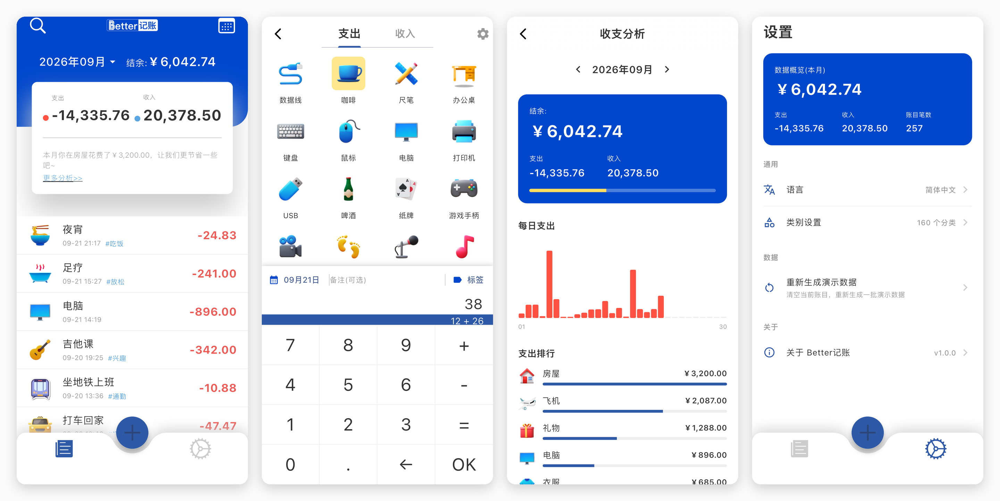
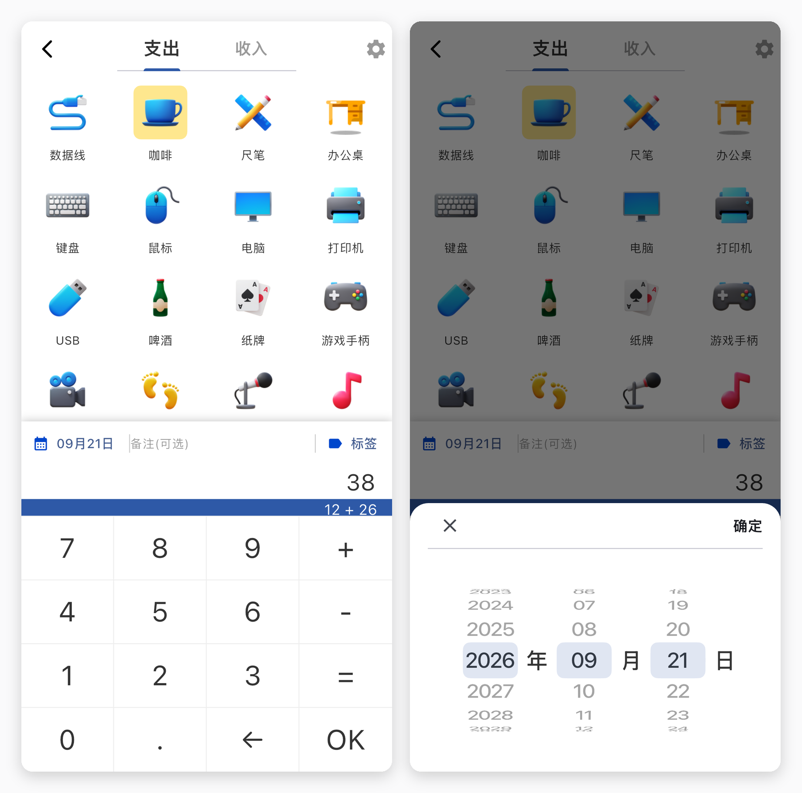
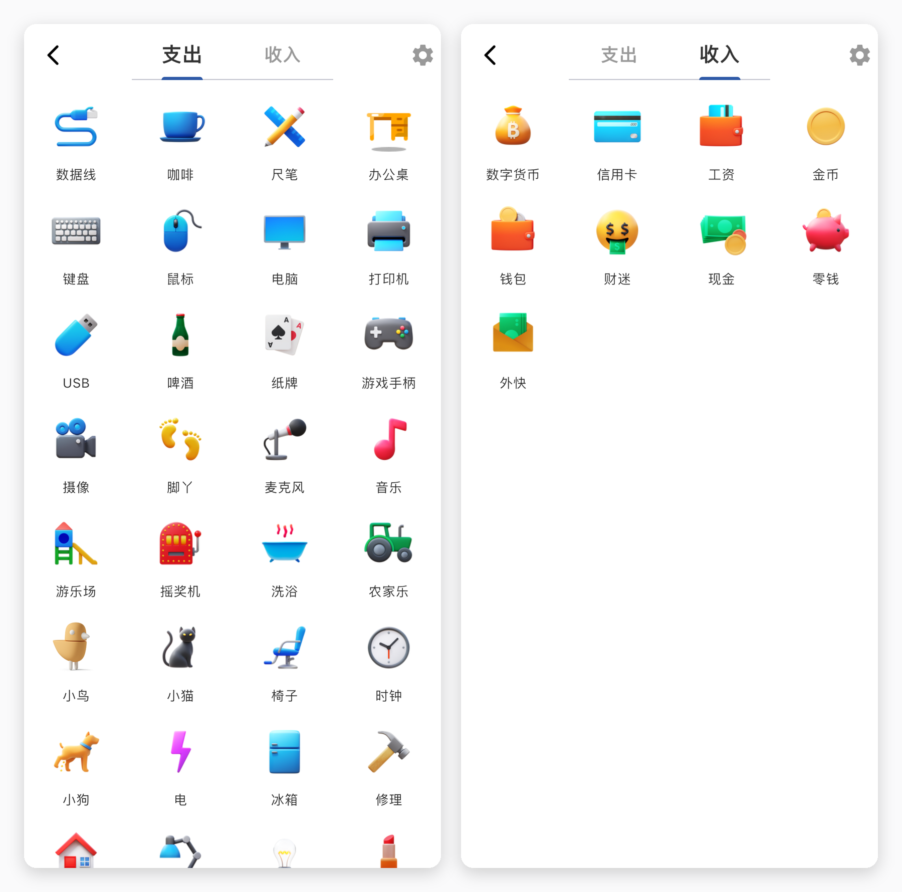
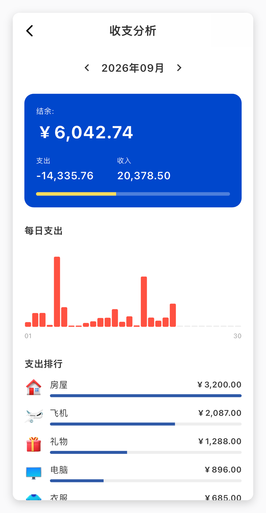
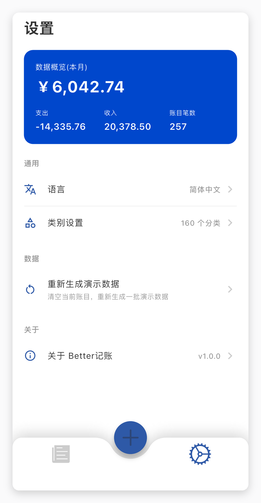

# Better记账



一个用 Flutter 写的记账 App：打开就能记，两个动作记完一笔，数据只存在手机里。

## 为什么做

我记账失败过两次，原因都一样：**记一笔太麻烦**。

打开、选账本、找分类、输金额、选支付方式、确认——五六步走完，新鲜劲已经过了。而我真正想知道的，其实只是"这个月钱花哪儿了"。

第二件事是数据。大部分记账 App 要注册账号，账目存在别人的服务器上。这些数字比我大部分聊天记录都私密，我不想它们离开手机。

所以目标定得很小：**打开就能记，两个动作记完一笔；数据只存在本机。**

## 记一笔只要两步

**点分类。** 首页的 + 打开分类页，160 个图标按支出、收入分成两栏——咖啡、地铁、房租、机票这些常出现的都在第一屏。

**敲金额。** 选中分类后键盘从底部滑上来。它不是普通数字键盘：**可以直接算数**。12 + 26 敲出 38，按 OK 存下这一笔。凑单、AA、拆报销这些场景，不用切出去开计算器。

键盘上面一行是日期和备注。默认记今天，想补记昨天就点一下日期；备注可以留空，不影响记账。



## 分类是自己理的

分类用了一整套 emoji 风格的插画，一共 160 个，按用途分成 10 组，收入单独一栏。

挑图标时想的不是"好看"，而是**扫一眼能不能认出这笔钱花在哪儿**——咖啡是一个杯子、通勤是地铁、加班打车是出租车、房租是房子。



## 想知道钱去哪了

首页上方是这个月的支出和收入，下面按时间倒序列出每一笔，带分类图标、备注、标签和金额。

分析页回答两个问题：这个月的钱**每天**是怎么花出去的（柱状图，哪几天是尖峰一眼能看见），以及**花在哪类**最多（支出排行，按金额从多到少）。

不做趋势预测、不做预算提醒、不做"你超支了"的警告——它只负责把事情摆出来。



## 数据在哪

这是我最在意的部分：

- **只有本机**：数据存在手机里的 Isar 数据库，不联网、不注册、不登录，断网也能用。
- **随时能看**：设置页有一份这个月的总览——结余、支出、收入、账目笔数。
- **可以重来**：第一次打开会写一批演示数据（最近三个月的账目）；想清空重来，设置里点一下"重新生成演示数据"就行。这个模块本来只是为了方便我自己调界面，后来发现给别人演示也很有用。



## 几个刻意的选择

**不做账号，也不做云同步。** 代价是换手机要自己想办法，也没有多设备同步。换来的是没有服务器，也就没有"服务停了账目就没了"这件事。

**用数字，不用"智能"。** 没有自动读短信、没有拍小票识别、没有 AI 猜分类。这些功能都要求把数据送出去，和我做这个 App 的出发点相反。

**计算器放在键盘里，而不是单独做一页。** 记账时算数是高频动作，把它放在正在用的地方，比教用户"你可以切到计算器页"更省事。

**支出和收入严格分开。** 两栏互不干扰，不做互相抵扣，也不做"净收入"这种需要心算的口径。

## 技术

Flutter 一套代码，目前只在 iOS 上验证过（Android 的构建配置还停在两年前的工具链，先欠着）。数据用 [Isar](https://pub.dev/packages/isar) 存在本地，路由和状态管理是 GetX，屏幕适配用 flutter_screenutil。统计、日期、金额格式化这些纯逻辑都拆了出来，有单元测试覆盖。

## 回头看

这个项目的第一版是 2023 年 6 月写的，写了两个月，然后停了三年。

今年重新打开时，第一件事不是加功能，而是让它先能编译：当时的 Flutter 版本、依赖、iOS 工程配置都已经和最新工具链对不上。修完编译又发现，启动时一直有个异常被静默吞掉——图标数据从来没写进数据库，所以分类页永远是空的。这种问题在当时的开发里完全没被注意到，因为界面看起来"能用"。

这次也补了两件事：把统计逻辑抽成纯函数并加单元测试；写了一个在数据库为空时自动灌演示数据的模块，顺手也成了这篇文章所有截图的来源。

还有一个教训是关于"完成度"的自我欺骗：界面上有搜索图标，但搜索没做；有标签和定位按钮，点了只弹一句"还在开发中"。停在半路的入口比没有入口更让人困惑——接下来要做的，要么把它们做完，要么先摘掉。

## 运行

```bash
flutter pub get
flutter run
```

需要 Flutter 3.44 或更高版本（Dart 3.12+）。iOS 真机调试需要在 Xcode 里选一下自己的开发团队。

```bash
flutter analyze
flutter test
```

## 协议

[MIT](LICENSE) © 2023 archerhan
